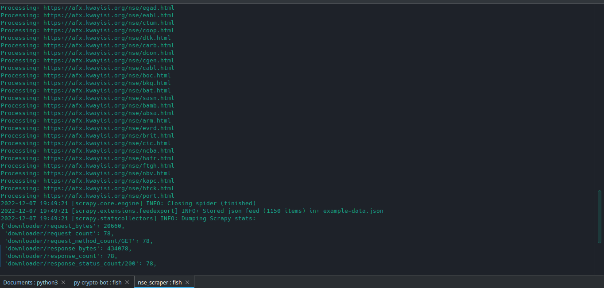
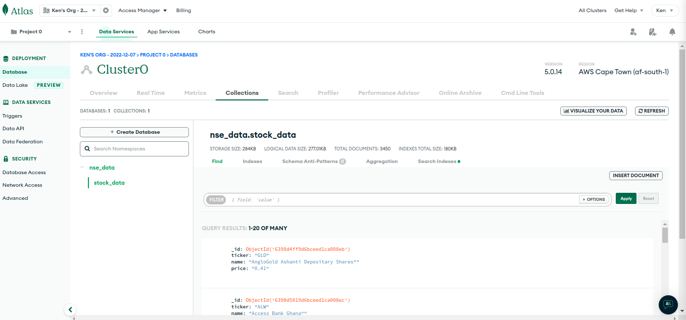
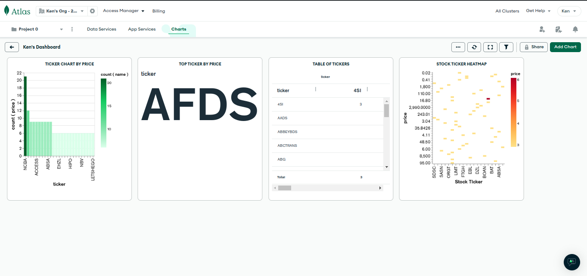

# Daily Stock Price Scraper

## Badges

[](https://github.com/KenMwaura1/stock-price-scraper/actions/workflows/python-app.yml)
[](https://www.python.org/)
  
[](http://perso.crans.org/besson/LICENSE.html)
[](https://github.com/ellerbrock/open-source-badges/)

## Overview

Web scraper utilizing scrapy to scrape live stock prices from the Nairobi Stock Exchange.
The prices are then saved in MongoDB Database after each scrape, we use pymongo to connect to MongoDb Atlas. We then proceed to use Atlas Charts to visualize the data.

The accompanying article can be found [here](https://dev.to/ken_mwaura1/nairobi-stock-exchange-web-scraper-mongodb-atlas-hackathon-2022-on-dev-5346)

## Screenshots







The actual platform we are scraping is [afx](https://afx.kwayisi.org/nseke/) website.

## Getting Started

### Prerequisites

- Python and pip (I am currently using 3.9.2) Any version above 3.7 should work.
- An [Africas Talking account](https://account.africastalking.com/auth/register/).
  - Api Key and username from your account. Create an app and take note of the api key.
- MongoDB Atlas account, create a free account [here](https://www.mongodb.com/cloud/atlas/register)
  - Create a cluster and take note of the connection string.

## Installation

Clone this repo

```bash
  git clone https://github.com/KenMwaura1/nse-stock-scraper
```

## Step 1

Change into the directory

`cd stock-price-scraper`

## Step 2

Create a virtual environment (venv) to hold all the required dependencies.Here we use
the built-in venv module.

`python -m venv env`

Activate the virtual environment

`source env/bin/activate`

Alternatively if you are using [pyenv](https://github.com/pyenv/pyenv).

```shell
pyenv virtualenv nse_scraper
pyenv activate nse_scraper
   ```

## Step 3

Install the required dependencies:

`pip install -r requirements`

## Step 4

Change into the nse_scraper folder and create an environment file.

```shell
cd nse_scraper
touch .env 
```

Add your credentials as specified in the example file.

OR

Copy the provided  example and edit as required:

`cp .env-example env`

## Step 5

Navigate up to the main folder *stock-price-scraper*
Run the scraper and check the logs for any errors .

```shell
cd .. 
scrapy crawl afx_scraper
```

or
Run the scraper and have it output to a json file to preview.

```shell
scrapy crawl afx_scraper -o test.json 
```

Tweak the project name as necessary.

Ensure you add your configuration variables in ‘Settings’ → ‘Reveal Config Vars‘. This will allow Heroku to get and set the required environment configuration for our web scraper to run.

```python
scrapy crawl afx_scraper
```

### Scheduling Text Notifications

Now we need add a scheduler for Heroku to run our notifiction script which will inturn send us texts. Since we already have an instance of Heroku running in our app we need an alternative. Advanced scheduler is a good option as it offers a free trial and if need be a $5 per month for an upgrade.

1. Setup
   Inside our daily-nse-scraper app, search for the advanced scheduler addon. Select the trail-free plan and submit order form.
   

2. Configuration

Click on the Advanced Scheduler addon. Inside the overview page. Click on Create trigger button. The free trial allows up-to 3 triggers.
We'll set a trigger for 11.00 am each day, specify the command `python nse_scraper/stock_notification.py` to run. Remember to select the correct timezone in my case its Africa/Nairobi and save the changes.

3. Testing
   To ensure the scheduler will execute as expected. We can manually run the trigger: on the overview page, click on the more button and select execute trigger.
   

You should now have received a notification text if everything went as expected.


## License

[MIT](https://choosealicense.com/licenses/mit/)
