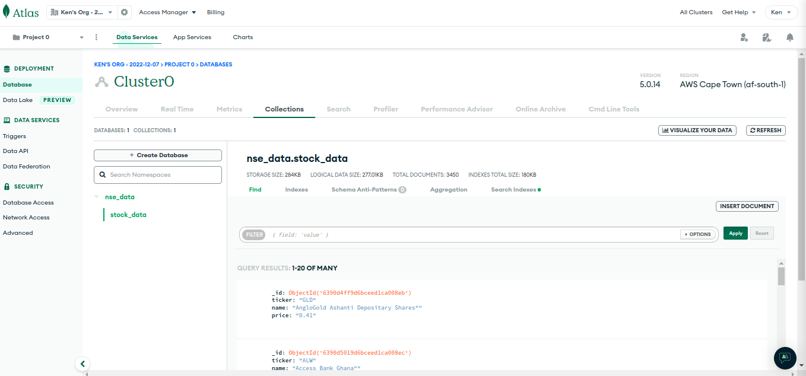

# Daily Stock Price Scraper

📚 **[View Full Documentation](docs/INDEX.md)** | 🚀 **[Quick Start](docs/QUICKSTART.md)** | 🐳 **[Docker Guide](docs/DOCKER.md)** | 📋 **[Project Structure](docs/PROJECT_STRUCTURE.md)**

## Badges

[](https://github.com/KenMwaura1/stock-price-scraper/actions/workflows/python-app.yml)
[](https://www.python.org/)
  
[](http://perso.crans.org/besson/LICENSE.html)
[](https://github.com/ellerbrock/open-source-badges/)

## Overview

A web scraper built with Scrapy that extracts live stock prices from the Nairobi Stock Exchange (NSE). The scraped prices are stored in a MongoDB Atlas database using PyMongo, and Atlas Charts is used to visualize the data.

The accompanying article can be found [here](https://dev.to/ken_mwaura1/nairobi-stock-exchange-web-scraper-mongodb-atlas-hackathon-2022-on-dev-5346).

## Screenshots





The actual platform we are scraping is [afx](https://afx.kwayisi.org/nseke/) website.

## Getting Started

### Prerequisites

- Python 3.11 or higher (tested with 3.11, 3.12, 3.13) and pip
- An [Africa's Talking account](https://account.africastalking.com/auth/register/)
  - API Key and username from your account. Create an app and note the API key
- A [MongoDB Atlas account](https://www.mongodb.com/cloud/atlas/register) (free tier available)
  - Create a cluster and note the connection string

## Installation

Clone the repository:

```bash
git clone https://github.com/KenMwaura1/nse-stock-scraper
cd nse-stock-scraper
```

Create and activate a virtual environment:

```bash
python -m venv env
source env/bin/activate
```

Alternatively, if you're using [pyenv](https://github.com/pyenv/pyenv):

```bash
pyenv virtualenv nse_scraper
pyenv activate nse_scraper
```

Install the required dependencies:

```bash
pip install -r requirements.txt
```

## Configuration

Create an environment file for your credentials:

```bash
cd nse_scraper
touch .env
```

Add your credentials (API keys, MongoDB connection string, etc.) to the `.env` file. You can reference the example file for the required variables.

Alternatively, copy the example environment file:

```bash
cp .env.example .env
```

Then edit `.env` with your credentials.

### Required Environment Variables

- **MONGODB_URI** - MongoDB Atlas connection string (with credentials)
- **MONGODB_DATABASE** - MongoDB database name (default: `nse_data`)
- **at_username** - Africa's Talking account username
- **at_api_key** - Africa's Talking API key
- **mobile_number** - Phone number for notifications (format: `+254XXXXXXXXX` for Kenya)

## Running the Scraper

From the project root directory, run the scraper:

```bash
scrapy crawl afx_scraper
```

To output results to a JSON file for preview:

```bash
scrapy crawl afx_scraper -o test.json
```

The scraper will:
1. Fetch stock data from the [AFX website](https://afx.kwayisi.org/nseke/)
2. Parse stock prices, symbols, and changes
3. Store data in MongoDB Atlas with a timestamp
4. Prevent duplicate entries using unique indexes

### Running with Docker

**Prerequisites:** Docker and docker-compose installed

**Setup:**
```bash
# Create environment file
cp .env.docker .env

# Edit .env with your credentials
nano .env
```

**Run the scraper:**
```bash
# Start MongoDB and run scraper
docker-compose up --build

# Run in background
docker-compose up -d

# View logs
docker-compose logs -f scraper

# Stop services
docker-compose down
```

**Run individual commands:**
```bash
# Run scraper with debug logging
docker-compose run --rm scraper crawl afx_scraper --loglevel=DEBUG

# Run notifications
docker-compose run --rm scraper python nse_scraper/stock_notification.py

# Access MongoDB shell
docker-compose exec mongodb mongosh
```

**Docker Tips:**
- MongoDB data persists in Docker volumes (`mongodb_data`)
- First run downloads ~500MB of images (Python, MongoDB)
- Subsequent runs are much faster
- For production, use environment variables instead of .env file

## Scheduling Text Notifications

To automate text notifications when stock prices change, use the `stock_notification.py` script with a scheduler.

### Running Notifications Manually

```bash
python nse_scraper/stock_notification.py
```

This will:
1. Query the latest stock data from MongoDB
2. Check if the stock price meets the configured threshold (default: ≥ 38 KES)
3. Send an SMS notification via Africa's Talking if the threshold is met

### Automating with a Scheduler

For Heroku deployments, use Advanced Scheduler:

1. Install the Advanced Scheduler addon from your Heroku dashboard
2. Click "Create trigger" and configure:
   - **Schedule**: Daily at 11:00 AM
   - **Command**: `python nse_scraper/stock_notification.py`
   - **Timezone**: Africa/Nairobi (or your timezone)
3. Test by clicking "Execute trigger" to verify notifications work

## Automated Quality Checks

This project uses GitHub Actions to automatically check code quality, security, and functionality on every push and pull request.

### Workflow: Python Application

**Jobs:**
- **Lint** - Checks code style with flake8, Black, and isort (Python 3.11)
- **Security** - Scans for vulnerabilities with Bandit and Safety (Python 3.11)
- **Test** - Tests across Python 3.11, 3.12, 3.13 with MongoDB 6.0, 7.0, 8.0 (9 test combinations)
- **Build** - Builds Docker image to ensure Dockerfile is valid

**View Results:**
- Go to **Actions** tab in GitHub to see workflow runs
- Click on a workflow run to see detailed job logs
- Pull requests show workflow status as checks

### Dependency Updates with Dependabot

Dependabot automatically checks for outdated dependencies and creates pull requests with updates:

**What it monitors:**
- Python packages (weekly updates)
- GitHub Actions (weekly updates)
- Docker base images (weekly updates)

**How it works:**
1. Dependabot creates a PR with dependency updates
2. Automated tests run on the PR
3. Review the changes and merge if tests pass
4. Dependencies stay current and secure

**Configuration:** `.github/dependabot.yml`

For local development or other platforms, use tools like:
- **Linux/Mac**: `cron` jobs
- **Windows**: Task Scheduler
- **Docker**: Scheduled containers
- **APScheduler**: Python-based scheduling library

## License

[MIT](https://choosealicense.com/licenses/mit/)

## Troubleshooting

### MongoDB Connection Errors
- Verify your `MONGODB_URI` is correct and includes credentials
- Check that your IP address is whitelisted in MongoDB Atlas (Network Access)
- Ensure the database name in `MONGODB_DATABASE` exists

### Scraper Not Finding Data
- Check that the target website structure hasn't changed
- Run with `LOG_LEVEL = "DEBUG"` in settings to see detailed parsing info
- Verify the CSS/XPath selectors match current HTML

### SMS Notifications Not Sending
- Verify Africa's Talking credentials are correct
- Check that your account has sufficient balance
- Ensure phone number format includes country code (e.g., +254XXXXXXXXX)

## Contributing

Contributions are welcome! Please:
1. Fork the repository
2. Create a feature branch (`git checkout -b feature/improvement`)
3. Make your changes and test
4. Submit a pull request

## Future Improvements

- [ ] Add multiple stock watchlists
- [ ] Implement price change threshold notifications
- [ ] Add data visualization dashboard
- [ ] Support multiple exchanges (ASE, BOURSE, etc.)
- [ ] Add unit tests for spider and pipeline
- [ ] Implement retry logic with exponential backoff
- [ ] Add Telegram/Slack notification options

